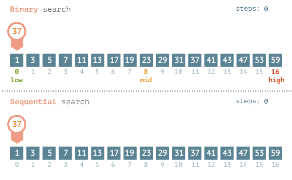
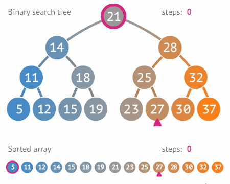

    

# Binary Search in Java (JVM) - Console Application

> "A **pesquisa** ou **busca binária** (em inglês binary search algorithm ou binary chop) é um algoritmo de busca em 
> vetores que segue o paradigma de **divisão e conquista**. Ela parte do pressuposto de que o vetor está ordenado e 
> realiza sucessivas divisões do espaço de busca comparando o elemento buscado (chave) com o elemento no meio do vetor. 
> Se o elemento do meio do vetor for a chave, a busca termina com sucesso. Caso contrário, se o elemento do meio vier 
> antes do elemento buscado, então a busca continua na metade posterior do vetor. E finalmente, se o elemento do meio 
> vier depois da chave, a busca continua na metade anterior do vetor.
>
> -- [Pesquisa Binária - Wikipedia](https://pt.wikipedia.org/wiki/Pesquisa_bin%C3%A1ria)

## Dependencies

- [Java `21`](https://sdkman.io/jdks/#amzn)

## Complexity Analysis

A complexidade do algoritmo de **Busca binária** é da ordem de **`O(log n)`**, em que **`n`** é o tamanho do 
vetor de busca. Apresenta-se mais eficiente que a **Busca linear** cuja ordem é **`O(n)`**.

## Procedure

Dado uma lista **&Alpha;** de **`n`** elementos com os valores **&Alpha;0, &Alpha;1, 
&Alpha;2, ..., &Alpha;n-1** ordenada de tal modo que **&Alpha;0 &le; 
&Alpha;1 &le; &Alpha;2  &le; ... &le; &Alpha;n-1**, e um valor para pesquisa 
**`T`**, a seguinte rotina usa pesquisa binária para achar o índice de **`T`** em **&Alpha;**.

1. Defina **`L`** para `0` e **`R`** para `n - 1`.
2. Se **L &gt; R** a pesquisa termina sem sucesso.
3. Defina **`m`**(o índice do meio da lista) para **`(L + R) / 2`** arredondado.
4. Se **&Alpha;m &lt; T**, defina **`L`** para **`m + 1`** e volte ao segundo passo.
5. Se **&Alpha;m &gt; T**, defina **`R`** para **`m - 1`** e volte ao segundo passo.
6. Se **&Alpha;m = T**, a pesquisa está feita, o índice de **`T`** é **`m`**.

> Para o algoritmo computacional ser mais eficiente, foi implementado uma validação de **Lista vazia**, evitando-se a 
> execução de procedimentos desnecessários! 

## How to run?

IntelliJ IDE

